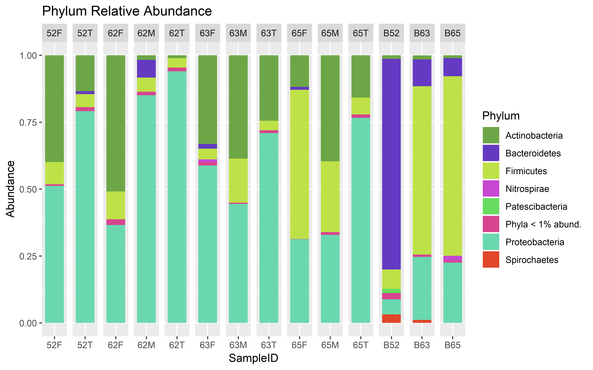

<style>
.remark-slide-number {
  position: inherit;
}

.remark-slide-number .progress-bar-container {
  position: absolute;
  bottom: 0;
  height: 4px;
  display: block;
  left: 0;
  right: 0;
}

.remark-slide-number .progress-bar {
  height: 100%;
  background-color: red;
}

</style>


```{r xaringan-logo1, echo=FALSE}
library(xaringan)
library(xaringanExtra)
library(emo)
library(knitr)
```

```{r setup commen, include=FALSE}
knitr::opts_chunk$set(comment="")
```


```{css, echo = FALSE}
.huge .remark-code { /*Change made here*/
  font-size: 150% !important;
}
.tiny .remark-code { /*Change made here*/
  font-size: 20% !important;
}

```

```{css, echo = FALSE}
.huge .remark-slide-content { /*Change made here*/
  font-size: 30 px !important;
}
.tiny .remark-slide-content { /*Change made here*/
  font-size: 7 px !important;
}

```

```{r update1, eval = FALSE, echo=FALSE}
xaringan::inf_mr()
```

```{r xaringanExtra-clipboard, echo=FALSE}
htmltools::tagList(
  xaringanExtra::use_clipboard(
    button_text = "<i class=\"fa fa-clipboard\"></i>",
    success_text = "<i class=\"fa fa-check\" style=\"color: #90BE6D\"></i>",
    error_text = "<i class=\"fa fa-times-circle\" style=\"color: #F94144\"></i>"
  ),
  rmarkdown::html_dependency_font_awesome()
)
```


```{r xaringan-panelset, echo=FALSE}
xaringanExtra::use_panelset()
```

```{r echo=FALSE}
style_panelset_tabs(foreground = "honeydew", background = "seagreen")
```

```{r xaringan-extra-styles, echo=FALSE}
xaringanExtra::use_extra_styles(
  hover_code_line = TRUE,         #<<
  mute_unhighlighted_code = TRUE  #<<
)
```

```{r setup, include=FALSE, echo=FALSE}
require("knitr")
opts_knit$set(root.dir = "~/Google Drive File Stream/Mi unidad/GitHub/UserR/docs")
```


```{r use-logo, echo=FALSE}
xaringanExtra::use_logo("imgs/1.png")
```

```{r xaringan-tile-view, echo=FALSE}
xaringanExtra::use_tile_view()
```

---
class: middle center bg-main1 hide_logo

# First...

--

# Look at this!

--


--

# It was made with R

---
class: bg-main1


# Why am I here?

--

### I'm Valéria's student `r emo::ji("heavy_check_mark")`

--

### I'm practicing how to make cool presentations `r emo::ji("heavy_check_mark")`

--

### Teach you how to code in R `r emo::ji("x")` <font size="2"> because I don't know yet</font>

--

### Show you *what you can do* with R `r emo::ji("heavy_check_mark")` <font size="2"> 10% of total </font>

--
### I`r emo::ji("heart")` R `r emo::ji("heavy_check_mark")`

--
### Share with you how I'm learning R `r emo::ji("heavy_check_mark")`

---

# How Did I started with R?

.center[

]

---

# How <font color="orange"> should </font> we learn R?

--

.center[.pull-left[


]
]

.center[.pull-right[
 


]
]
---

# How am I learning R?

--

### - Hands on!
--

### - I see a lot of Youtube videos

--

### - I practice with scripts written for someone else

--

### - Some free and not free courses

--

### - Following and joining R communities, like 

--

### - Actually, I do <font color= "green"> **EVERYTHING** </font> in R <font size="2"> (this slides for example) </font>

---

# How am I learning R?

### - Being <font color= "green"> **PATIENT** </font>


.center[

]

---
class: center, middle, inverse

# Why should you use/learn R? 
<font size="2"> (that I know at this time!) </font>

---

### - Free and Open-source language

--

### - Large community of Users

--

### - Great visualizations - Graphs <font color= "green"> ready-to-print </font>
--

### - Advanced Statistical Language

--

### - Used in almost every area

--

### - Big Data (Large dataset)

---
class: center, middle

### - MONEY!

.center[

]

---

### Why   is better than ?

--

#### 1. Data manipulation

--

#### 2. Easier automation

--

#### 3. Faster computation

--

#### 4. It reads any type of data

--

#### 5. Easier project organization

--

#### 6. It supports larger data sets

--

#### 7. Reproducibility

--

#### 8. Accuracy

--

#### 9. Easier to find and fix errors

--

#### 10. It's free and open source


---

### Why   is better than ?

--

#### 11. Advanced Statistics

--

#### 12. More beautiful and printable graphs

--

#### 13. It runs on many platforms

--

#### 14. Anyone can contribute to improve

---

### Why   is better than ?

.center[

]

---

class: center, middle, inverse

# But...

--
# Which is the potential it of R for our projects? 
<font size="2"> (that I know at this time!) </font>

---
class: middle, center, hide_logo
background-image: url("imgs/microbiome.jpeg")
background-size: cover

<font color= "red", font size = "15"> Microbiome analysis with: </font>

.center[
 
]

---
class: middle, center

### You can use the *Qiime2* outputs to form a <font color= "dark yellow"> phyloseq object... </font>

.center[

]

### ... and then doing <font color= "blue"> a lot of data processing, or data transformations and off course a lot of analysis </font>

---
class: inverse, center, middle

#Some examples

---

### Important functions:

.panelset[
.panel[.panel-name[Accessors]

- How many samples are there? `nsamples()`


- How many taxas are there? `ntaxa()`


- Which are the variables of your study? `sample_variables()`


- How many sequences are there in each sample? `sample_sums()`


- And so on...
]


.panel[.panel-name[Processors]

- Are you interested in specific phylum (class, order, etc)? `subset_taxa()`
  
  For example only Firmicutes phylum

- Are you interested in the taxonomic classification only until family? `tax_glom()`

- Are you interested in specific group of samples? `subset_samples()`
  
  For example only samples from local A

- Do you want to filter the samples? `prune_samples()`
  
  For example only the first 20 samples.

]


.panel[.panel-name[Manipulating]

- Do you want to rarefy to the smallest sample? `rarefy_even_depth()`

- Do you want to normalize your dataset to relative abundance? `transform_sample_counts()`

]
]
---
class: center, middle, inverse

# Exploratory analysis

---

## Alpha diversity

.panelset[
.panel[.panel-name[BoxPlot]


```{r boxplot, echo=FALSE, fig.align = 'center', out.width = "90%"}

```

You can plot the alpha diversity indexes as a box plot
]

.panel[.panel-name[DotPlot]
.center[

]

Or as a dot plot.
]

.panel[.panel-name[Table]
```{r tabela diversidade alfa, eval= TRUE, message=FALSE, warning=FALSE, echo=FALSE, comment=FALSE}
table <- read.csv("imgs/alpha_diversity.csv", header = T, sep = ",")
```

```{r exemplo5, eval= TRUE, echo=FALSE, comment=FALSE, warning=FALSE, message=FALSE}
require(dplyr)
require(kableExtra)
kbl((table)[1:15, ]) %>%
  kable_classic("hover", full_width=F) %>%
  row_spec(0, bold = T)%>%
  kable_styling(font_size = 9)
```
]

.panel[.panel-name[Rarefaction Curves]


.center[

]
]
]
---

## Beta diversity `plot_ordination()`

.panelset[
.panel[.panel-name[Samples]
.center[

]

You can plot different distance metrics, like Bray-Curtis, Jaccard, Unifrac, and many others...
]


.panel[.panel-name[Samples and Taxas]

And if you want to plot the ordination of your samples and your taxa?

.center[

]

Here you can associate the phyla with the samples
]
]

---

## Community composition

.panelset[
.panel[.panel-name[BarPlots]

.center[.pull-right[
 
]]
.center[.pull-left[

]
]
]


.panel[.panel-name[Heatmaps]
.center[

]
]

.panel[.panel-name[Clustering Heatmaps]
.center[

]
]


.panel[.panel-name[InteractivePlots]
#### Krona

.center[

]
]

.panel[.panel-name[WordClouds]

.center[
 
]
]
]

---

## Other graphs types

.panelset[
.panel[.panel-name[TernaryPlot]

.center[
 
]
]


.panel[.panel-name[TreeMap]
.center[

]
]

.panel[.panel-name[Upset Plot]
.center[

]
]
]

---
class: center, middle, inverse

# Now, Can you imagine how you could do all this in Excel?

.center[

]

---
class: middle

## Which is more suitable for printing?

.center[.pull-left[
### This 

 
]
]
.center[.pull-right[
### or this?

]
]
---
class: middle

## Time to open...

.center[.pull-left[
### This ...

]
]

#### 1 minute and 20 seconds

.center[.pull-right[

]
]
---
class: middle

### or this?
.center[.pull-left[

]
]

#### 20 seconds


.center[.pull-right[

]
]

---
class: center, middle, inverse


# Let's learn how to make a simple barplot

---

```{r Read qza, eval= TRUE, echo=FALSE, message=FALSE, warning=FALSE, comment=FALSE}
## Lendo o artefato table.qza, tabela com as freqüências das ASVs (espécies)
library(qiime2R)
ASVs <- read_qza("01.Data/table.qza")
metadata <- read_q2metadata("01.Data/sample-metadata.tsv")
taxonomy <- read_qza("01.Data/taxonomyclassification.qza")
taxonomy <- parse_taxonomy(taxonomy$data)
tree <- read_qza("01.Data/tree.qza")
physeq<-qza_to_phyloseq(
    features = "01.Data/table.qza",
    tree="01.Data/tree.qza",
    taxonomy="01.Data/taxonomyclassification.qza",
    metadata = "01.Data/sample-metadata.tsv"
    )
```

## Phyloseq Object

```{r physeq, eval= TRUE, warning=FALSE}
library(phyloseq)
physeq
```
#### We have a phyloseq object called "physeq" that has 54 samples, 1082 different taxa in 7 taxonomic ranks. 
---

```{r sample_sums, eval= TRUE}
sample_sums(physeq)
```

---

#### We have to convert the frequency values (or hits) in relative abundance

```{r transform, eval= TRUE}
count_to_prop <- function(x) {return (x / sum (x))}
transf_physeq <- transform_sample_counts(physeq, count_to_prop)
sample_sums(transf_physeq)
```
As you can see now, all the samples sums are 1

---

## Now, we're going to plot

.center[.pull-left[
```{r barplot1.2, eval= TRUE, message=FALSE, comment=FALSE}
library(ggplot2)
plot_bar(transf_physeq, fill = "Phylum")
```
]
]

.center[.pull-right[
This is the simplest barplot, but you can customize <font color="red"> ALL </font> the elements of the graph
]
]
---
class: hide_logo

.panelset[
.panel[.panel-name[CODE]
```{r barplot2.2, eval= FALSE}
plot_bar(transf_physeq, fill = "Phylum") + 
  facet_wrap(~transect.name, scales = "free_x", nrow = 1) +  # here you can grouped by some characteristic of your data
  geom_bar(aes(color=Phylum, fill=Phylum), stat="identity", position="stack") +
  theme(axis.title.y = element_text(size = 16, face = "bold", color = "red")) +
  theme(axis.title.x = element_blank()) +
  theme(axis.ticks = element_line(color = "blue")) +
  theme(axis.text.x = element_text(angle = 90, size = 7, vjust = 0.3, hjust = 0)) +
  theme(axis.text.y = element_text(size = 14, face = "italic", color = "purple")) +
  theme(strip.background = element_rect(color = "green", fill = "green")) +
  theme(strip.text = element_text(color = "orange", face = "bold")) +
  theme(legend.title = element_text(face = "bold", size = 16)) +
  theme(legend.text = element_text(face = "italic"))
```
]

.panel[.panel-name[PLOT]

#### Voilà!
.center[.pull-left[
```{r barplot2, eval= TRUE, echo=FALSE}
plot_bar(transf_physeq, fill = "Phylum") + 
  facet_wrap(~transect.name, scales = "free_x", nrow = 1) +  # here you can grouped by some characteristic of your data
  geom_bar(aes(color=Phylum, fill=Phylum), stat="identity", position="stack") +
  theme(axis.title.y = element_text(size = 16, face = "bold", color = "red")) +
  theme(axis.title.x = element_blank()) +
  theme(axis.ticks = element_line(color = "blue")) +
  theme(axis.text.x = element_text(angle = 90, size = 7, vjust = 0.3, hjust = 0)) +
  theme(axis.text.y = element_text(size = 14, face = "italic", color = "purple")) +
  theme(strip.background = element_rect(color = "green", fill = "green")) +
  theme(strip.text = element_text(color = "orange", face = "bold")) +
  theme(legend.title = element_text(face = "bold", size = 16)) +
  theme(legend.text = element_text(face = "italic"))
```
]
]

.center[.pull-right[
##UGLY!
]
]
]
]

---

## Bonus

<font color= "blue"> I want hue! </font> is a webpage where come up with pallet of colors

.center[

]

---

## Let's change the palette of colors

.panelset[
.panel[.panel-name[CODE]
```{r barplot3, eval= FALSE}
colors26 <- c("#d2414d", "#48c475", "#cf46a9", "#80bf42", "#7662d6", "#429735", "#cd75de", "#bcaf3d", "#9544a9", "#9cb169", "#4b78d0", "#dc953b", "#629fd6", "#d7562e", "#43c4c6", "#de4c83",
"#5ab68e", "#a0477b", "#367b4c", "#d68ec5", "#677629", "#806db3", "#937334", "#a9515f",
"#a7592f", "#e5917a")

plot_bar(transf_physeq, fill = "Phylum") + 
  facet_wrap(~transect.name, scales = "free_x", nrow = 1) +  # here you can grouped by some characteristic of your data
  geom_bar(aes(), stat="identity", position="stack") +
  theme(axis.title.y = element_text(size = 16, face = "bold", color = "red")) +
  theme(axis.title.x = element_blank()) +
  theme(axis.ticks = element_line(color = "blue")) +
  theme(axis.text.x = element_text(angle = 90, size = 7, vjust = 0.3, hjust = 0)) +
  theme(axis.text.y = element_text(size = 14, face = "italic", color = "purple")) +
  theme(strip.background = element_rect(color = "green", fill = "green")) +
  theme(strip.text = element_text(color = "orange", face = "bold")) +
  theme(legend.title = element_text(face = "bold", size = 16)) +
  theme(legend.text = element_text(face = "italic")) +
  scale_fill_manual(values = colors26)
  
```
]

.panel[.panel-name[PLOT]
```{r barplot10, eval= TRUE, echo=FALSE}
colors26 <- c("#d2414d", "#48c475", "#cf46a9", "#80bf42", "#7662d6", "#429735", "#cd75de", "#bcaf3d", "#9544a9", "#9cb169", "#4b78d0", "#dc953b", "#629fd6", "#d7562e", "#43c4c6", "#de4c83",
"#5ab68e", "#a0477b", "#367b4c", "#d68ec5", "#677629", "#806db3", "#937334", "#a9515f",
"#a7592f", "#e5917a")

plot_bar(transf_physeq, fill = "Phylum") + 
  facet_wrap(~transect.name, scales = "free_x", nrow = 1) +  # here you can grouped by some characteristic of your data
   geom_bar(aes(), stat="identity", position="stack") +
  theme(axis.title.y = element_text(size = 16, face = "bold", color = "red")) +
  theme(axis.title.x = element_blank()) +
  theme(axis.ticks = element_line(color = "blue")) +
  theme(axis.text.x = element_text(angle = 90, size = 7, vjust = 0.3, hjust = 0)) +
  theme(axis.text.y = element_text(size = 14, face = "italic", color = "purple")) +
  theme(strip.background = element_rect(color = "green", fill = "green")) +
  theme(strip.text = element_text(color = "orange", face = "bold")) +
  theme(legend.title = element_text(face = "bold", size = 16)) +
  theme(legend.text = element_text(face = "italic")) +
  scale_fill_manual(values = colors26)
```
]
]

---
class: center, middle, inverse

# That's all! 

--

#### All these slides were coding using R and  

--

# Gracias!


